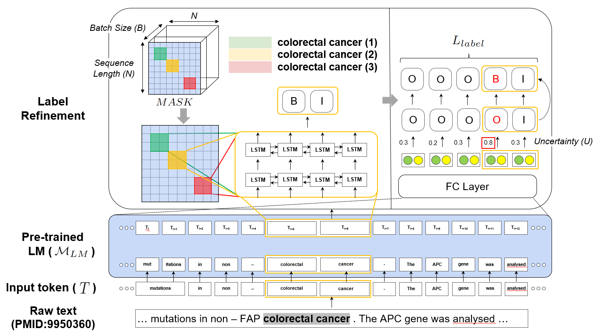

# ConNER
We present **ConNER** (Enhancing Label **Con**sistency on Document-level **N**amed **E**ntity **R**ecognition, a method that improves label agreement of modifiers (e.g., adjectives and prepositions) to make your models more consistent on biomedical text. This repository provides a way to train and evaluate our <em>ConNER</em> approach. Please see our [paper](TBD) for more details.)

<div align="center">
      
</div>

## Updates

* \[**Sep 30, 2022**\] First code updates.

## Quick Link
* [Installation](#installation)
* [Resources: datasets, pre-trained models, fine-tuned models](#resources)
* [Traning and Inference](#training-and-inference)
* [References](#references)
* [License](#license)
* [Contact Info.](#contact-information)

## Installation
You need to install dependencies to use ConNER.
```bash
# Install torch with conda (please check your CUDA version)
conda create -n conner python=3.8
conda activate conner
pip install torch==1.9.0+cu111 torchvision==0.10.0+cu111 torchaudio==0.9.0 -f https://download.pytorch.org/whl/torch_stable.html

# Install ConNER 
git clone https://github.com/dmis-lab/ConNER.git
pip install -r requirements.txt
```

## Resources

### 1. Datasets
We updated our resource files of four biomedical benchmarks, pre-trained model, and fine-tuned models. 
* [Datasets](http://nlp.dmis.korea.edu/projects/conner-jeong-et-al-2022/data)
* [Pre-trained](http://nlp.dmis.korea.edu/projects/conner-jeong-et-al-2022/pre-trained)
* [Fine-tuned](http://nlp.dmis.korea.edu/projects/conner-jeong-et-al-2022/fine-tuned)

## Training and Inference
TBD

## References
Please cite our paper if you use ConNER in your work:
TBD

## License
Please see LICENSE for details.

## Contact Information
Please contact Minbyul Jeong (`minbyuljeong (at) korea.ac.kr`) for help or issues using ConNER.
